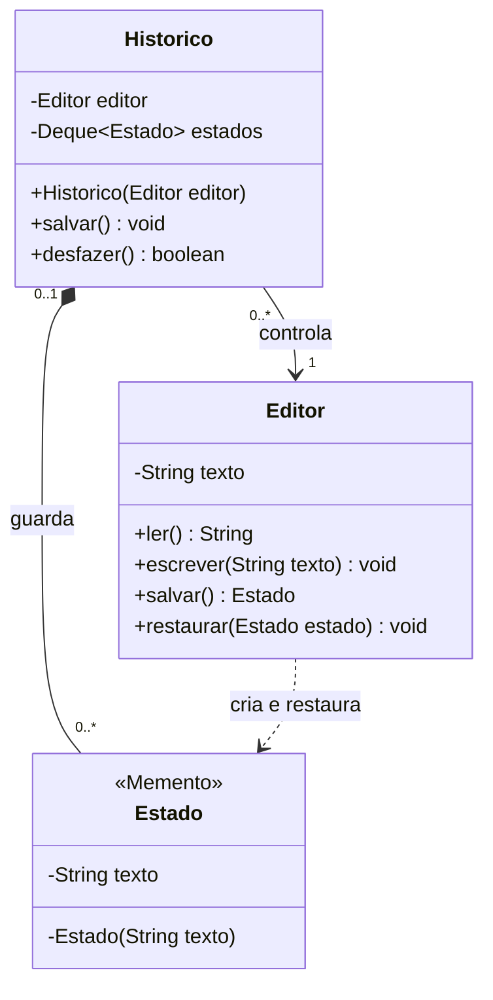

```mermaid
classDiagram
    class Editor {
        -String texto
        +ler() String
        +escrever(String texto) void
        +salvar() Estado
        +restaurar(Estado estado) void
    }

    class Estado {
        <<Memento>>
        -String texto
        -Estado(String texto)
    }

    class Historico {
        -Editor editor
        -Deque~Estado~ estados
        +Historico(Editor editor)
        +salvar() void
        +desfazer() boolean
    }

    Historico "0..*" --> "1" Editor : controla
    Historico "0..1" *-- "0..*" Estado : guarda
    Editor ..> Estado : cria e restaura
```
